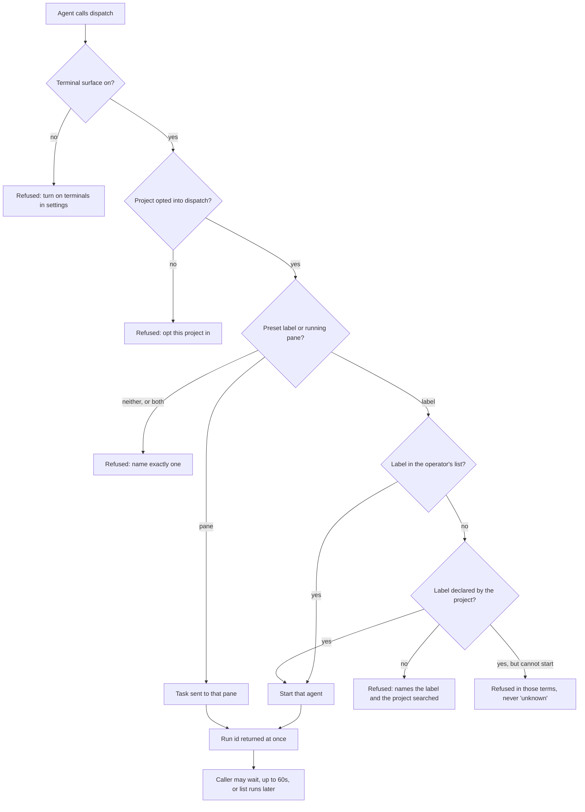

# Spec: MCP surface

The doorway through which a coding agent talks to waggledance. Everything a
person reaches by opening the browser — a rendered document, a search, the list
of projects, a project's work state, the fleet of running agent terminals — an
agent reaches here instead, as named tools it calls rather than files it opens
and parses for itself. Two of the tools go further than reading: they start work
in a project and wait for it. The surface exists so an agent never has to know
where waggledance keeps anything, and so the one place that decides what an agent
may see and start is this door rather than each caller's own habits.

## Entry Points & Triggers

- an agent's MCP client launching waggledance as a server → the seven tools below
  are offered; the conversation speaks JSON-RPC over the process's own input and
  output, and every diagnostic goes to the error channel so it can never corrupt
  the protocol
- a tool call naming one of the seven → that tool runs and answers
- a tool call naming anything else → a "method not found" refusal, never a guess

The server runs as its own process, launched by the agent's client rather than by
a person. It answers most calls from the installation's own index without anything
else running; the one call that hands back a browser address makes sure the
browsing daemon is up first, so the address it returns is one a person can open.

## Data Dictionary

| # | Element | Meaning | Values | Required | Default |
|---|---|---|---|---|---|
| 1 | Project | Which registered project a call is about | a project's own id | varies per tool | — |
| 2 | Project root | Where a project lives, when naming it for the first time | absolute path | yes, for viewing a file | — |
| 3 | Relative path | Which document inside that project to make viewable | path below the project root | yes, for viewing a file | — |
| 4 | Query | What to search for across indexed documents | free text | yes, for searching | — |
| 5 | Limit | How many search hits to return | count | no | the surface's own default |
| 6 | Preset label | The **name** of an agent configuration to start — never a command | a label the operator or the project declares | one of preset/pane, for dispatch | — |
| 7 | Pane id | An already-running agent terminal to send work to instead of starting one | a pane's own id | one of preset/pane, for dispatch | — |
| 8 | Task | The work to hand the agent | free text | yes, for dispatch | — |
| 9 | Run id | The dispatched run to wait on or report | the id dispatch returned | yes, for awaiting | — |
| 10 | Timeout | How long to wait for a run | seconds, clamped to 60 | no | 60 |
| 11 | Run status | Where a dispatched run stands | `working` · `done` · `blocked` — stopped on something only a person can clear · `timeout` — the wait ended, the run did not | — | — |
| — | Terminal switch (config, not shown) | Whether this installation offers agent terminals at all | on/off | — | off |
| — | Per-project dispatch opt-in (config, not shown) | Whether this project accepts dispatched work | on/off | — | off |

## Behaviors & Operations

### Make a document viewable

- **Blocked when:** either the project root or the document path is missing — both
  are required and the refusal says so. A project not yet known is not a blocker:
  it is registered on the spot.
- **What changes:** the project is registered if this is the first time it is
  named, and the document is indexed immediately rather than at the next sweep.
- **Afterwards:** the caller receives the document's browser address, ready to
  hand to a person. There is no separate registration step to remember.

### Search the indexed documents

- **Blocked when:** nothing.
- **What it does:** searches every registered project's indexed markdown, or one
  project when named. Before answering it refreshes what changed on disk in the
  projects it is about to search, so a document edited a moment ago is findable.
- **On partial failure:** a project whose refresh failed is named in the answer.
  Hits still return — a failure degrades one project's freshness, never the
  search — and the caller is told which project's results may lag disk.
- **Afterwards:** each hit carries an excerpt with the matched words marked,
  written to be enough to answer from without opening the document.

### List the projects

- **What it returns:** every registered project — its id, name, root, how many
  documents are indexed, and when it was last seen.

### Ask a project's state

- **Blocked when:** nothing. This tool never writes and never starts anything.
- **What it returns:** a project's parsed work state — the feature being worked,
  the phase, open and blocked cells, recent decisions, sessions, any handoff, and
  what is waiting on a person — so the caller never reads or parses a store file
  itself. Naming no project returns the same shape rolled up across every
  registered project.
- **What it returns about the fleet:** two further parts describe the running
  agents rather than the store (per `4656fa38`). The first names the kinds of
  agent this project offers and which of those can actually be started right now.
  The second is the inventory of agent terminals contained by this project, with
  the project's own work state joined in, so a caller can see that a suitable
  agent is already running.
- **What it never returns:** the command behind any agent kind. Only labels are
  published — the name of a default, the names a project declares — never the
  program, arguments, environment or directory behind them (per `a0b97441`). An
  agent kind configured as a bare command line therefore has no publishable name
  and is reported as having none. The pane inventory is filtered to the panes this
  project contains, never widened to the machine (per `d1c12875`).
- **When the fleet cannot be read:** if agent terminals are switched off for this
  installation, the pane part is absent entirely — not empty, not null — and the
  answer is the store-only answer every caller had before the fleet was published
  (per `6ffa653e`). If terminals are on but the fleet cannot be reached, the pane
  part is null with the reason named beside it, and the work-state half of the
  answer is unaffected (per `074e6ca0`). A rollup covering many projects reads the
  fleet once, not once per project (per `6cf068ce`).
- **Afterwards:** nothing changed. Seeing a pane grants nothing — being able to
  read the inventory is not permission to dispatch to it (per `f0719967`), and
  whether to reuse an idle agent rather than start a new one is the calling
  agent's own policy, never waggledance's (per `88bdfec0`).

### Dispatch work to an agent

- **Blocked when:** agent terminals are switched off for this installation — the
  refusal names the settings page that turns them on. Or the target project has
  not opted into dispatch — the refusal names that project and its own settings
  page. Both refusals are cheap and come before anything is started.
- **Blocked when (continued):** neither a preset label nor a pane is given, or
  both are. Exactly one is right: start a fresh agent, or send work to one already
  running. A raw command is never accepted from the caller in either case.
- **How a label is resolved:** the operator's own global list is searched first,
  then the target project's declared agent kinds. Global-first is what keeps the
  rule additive — a label an installation already configured keeps pointing where
  it did, and only labels that used to refuse can begin resolving. A label in
  neither is refused before anything is started, naming both the label and the
  project whose list was searched. A label the project declares but that cannot be
  started refuses in those terms rather than as "unknown".
- **What changes:** an agent is started, or an already-running one is given the
  task.
- **Afterwards:** the caller receives a run id immediately, without waiting for
  the work. The run records the label it was given, not which of the two lists
  resolved it.

### Wait for a dispatched run

- **What it does:** blocks until the run finishes, stops on something only a
  person can clear, or the wait elapses — whichever comes first.
- **The wait is bounded:** at most 60 seconds, whatever was asked for. A longer
  request is quietly shortened rather than honoured or refused, so no caller can
  hold the surface open indefinitely.
- **Afterwards:** the caller receives where the run stands and what the agent has
  said since the work was dispatched.

### List dispatched runs

- **What it returns:** every dispatched run and where it stands, optionally
  narrowed to one project. Read-only: listing a run never changes it.

## Actors & Access

| Capability | Calling agent | Calling agent, terminals off | Calling agent, project not opted in | Operator (via settings) |
|---|---|---|---|---|
| View a document, search, list projects | ✓ | ✓ | ✓ | ✓ |
| Ask a project's work state | ✓ | ✓ | ✓ | ✓ |
| See the agent kinds and pane inventory | ✓ | — (absent from the answer) | ✓ | ✓ |
| Dispatch work | ✓ | — (refused) | — (refused) | turns both switches on |
| Wait on, and list, runs | ✓ | ✓ | ✓ | ✓ |
| Learn the command behind an agent kind | — | — | — | ✓ (it is their own config) |

## Business Rules

- **R1.** The two switches — this installation's terminal surface, and the target
  project's own dispatch opt-in — are the only gate on dispatching, and reading
  the fleet never widens them (per `f0719967`).
- **R2.** A caller names an agent kind by label and never supplies a command,
  arguments, environment or directory, from any source.
- **R3.** The published agent registry carries labels only; the commands behind
  them are never published (per `a0b97441`).
- **R4.** The published pane inventory is filtered to what the named project
  contains and is never widened to everything running on the machine (per
  `d1c12875`).
- **R5.** A wait is clamped to 60 seconds server-side; a longer request is
  shortened silently rather than refused.
- **R6.** Asking for state, listing runs, listing projects, and searching never
  change anything; only making a document viewable and dispatching do.
- **R7.** Whether to reuse an idle agent instead of starting a new one is the
  calling agent's policy, never waggledance's — this surface reports, it does not
  choose (per `88bdfec0`).
- **R8.** "Can this label be started?" has exactly one answer in this system: the
  question the state answer reports and the question dispatch asks are the same
  question, answered the same way.

## Edge Cases Settled

- A project named for the first time when making a document viewable is
  registered on the spot; there is no separate registration call to forget.
- A search whose refresh fails for one project still answers, naming the project
  whose results may be stale rather than failing the whole search.
- With terminals switched off, the pane part of a state answer is *absent*, which
  is a different answer from *present but empty* — the caller can tell "this
  installation does not do terminals" from "this project has none running".
- An agent kind configured as a bare command line publishes no label, because its
  tokens are exactly what may not be published.
- A label that both the operator and the project declare resolves to the
  operator's, so configuring a project can never silently re-aim a label that
  already worked.
- A method name the surface does not offer is refused as not found rather than
  guessed at.

## Open Gaps

- The exact shape of each tool's answer — field names and nesting — is not stated
  here. Answered by reading the surface's own tool declarations, which callers
  already receive; worth writing down only if a consumer needs to depend on it.
- What happens to a dispatched run whose agent is closed by a person mid-run, and
  whether the run's final state distinguishes that from a normal finish. Answered
  by the run-status handling, not yet inventoried.
- Whether search results are ranked, and by what, beyond carrying a marked
  excerpt. Answered by the indexing area, which owns ranking.
- Whether repeated dispatch to the same already-running pane queues, interleaves,
  or refuses. Answered by the terminal area's own reply handling.

## Diagrams

## Visuals

Not applicable — no screen. The operator-facing halves of this area are the
settings pages that hold the two switches, which belong to the settings area.

## Pointers (implementation)

- `crates/waggledance/src/mcp.rs` — the whole surface: tool declarations, the
  dispatcher that routes a call to its handler, and each handler.
- `crates/waggledance/src/mcp.rs` (`read_fleet_panes`) — the one read of the
  running fleet per call, and the switched-off short-circuit.
- `crates/waggledance/src/mcp.rs` (`resolve_preset`) — label resolution, global
  list before the project's own.
- `waggledance mcp` — the command an MCP client launches; JSON-RPC on standard
  output, diagnostics on standard error.
